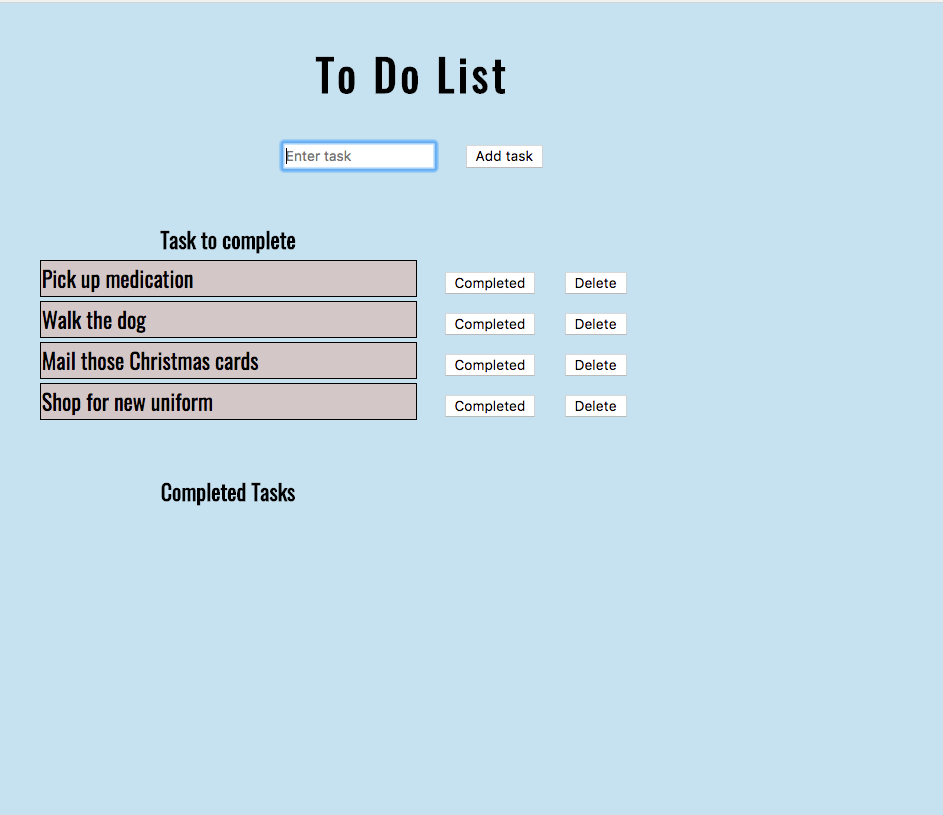
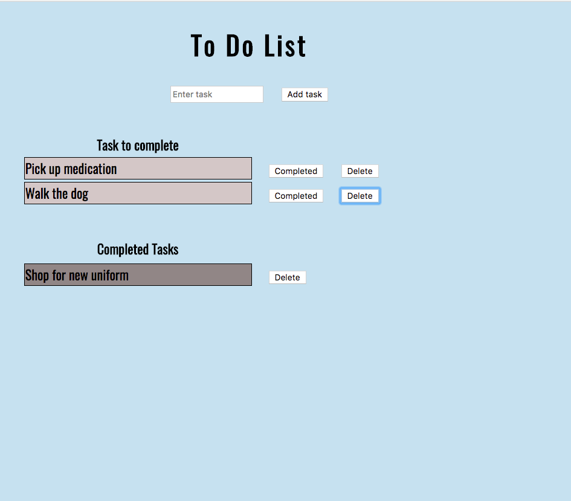

# To Do app
To Do is a CRUD app (Create-Read-Update-Delete) that compares each function in jQuery to that used in AngularJS. The user enters a task to complete, which is then posted to a pSQL database. The task can then be "completed" (updated), or deleted. When the task is marked as completed, it is displayed in the lower table.

    

    

## Change between jQuery and AngularJS versions
Go to routes/index.js, and change line 7 file from 'index.html' (jQuery) to 'index2.html' (AngularJS).

### Technology Used
jQuery, AngularJS, PostgreSQL, Node.JS, Express, AJAX. Focus on using "this" to append selected elements in jQuery, versus using the two-way bind and ng-repeat in Angular.

### Features to add
* Add delete confirm to AngularJS version.
* Add selectable date/time to complete task by.
* Sort tasks by date/time.